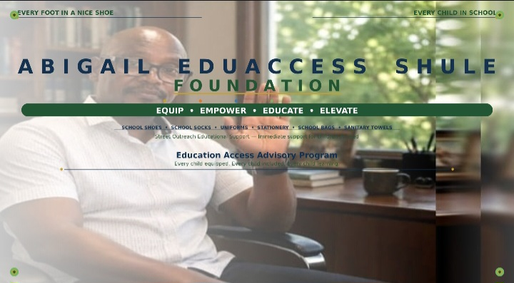

<!DOCTYPE html>
<html lang="en">
<head>
    <meta charset="UTF-8">
    <meta name="viewport" content="width=device-width, initial-scale=1.0">
    <title>Abigail Eduaccess Shule</title>
    
</head>
<body><!-- Hero Section with Logo -->
<section style="text-align: center; padding: 40px 20px; background-color: #f8f9fa;">
  
  <h1 style="margin-top: 20px; color: #1a5f2a; font-family: Georgia, serif;">
    Abigail Eduaccess Shule Foundation
  </h1>
  

    Equip • Empower • Educate • Elevate
  

</section>

    <header>
        
🎓

        <h1>Abigail Eduaccess Shule</h1>
        
Education Access Advisory Program

        
Abigail Eduaccess

        
Shule Foundation

        
Empowering Children Through Education

        
Equip • Empower • Educate • Elevate

        
🦁 Every foot in a nice shoe, every child in school

        

            <a href="#sponsor">Sponsor a Child</a>
            <a href="#ebook">Buy the E-Book</a>
            <a href="#mission">Learn More</a>
        

    </header>
    <nav>
        <a href="#mission">Mission</a>
        <a href="#provide">What We Provide</a>
        <a href="#impact">Impact</a>
        <a href="#founder">Founder</a>
        <a href="#ebook">E-Book</a>
        <a href="#sponsor">Sponsor</a>
        <a href="#help">Help</a>
    </nav>
    <section id="mission">
        <h2>Our Mission</h2>
        
We believe every child deserves access to quality education regardless of their background.

    </section>

    <section id="provide">
        <h2>What We Provide</h2>
        
Educational resources, scholarships, mentorship programs, and school support.

    </section>

    <section id="impact">
        <h2>Our Impact</h2>
        
500+ children sponsored. 20+ schools supported. 10,000+ books distributed.

    </section>

    <section id="founder">
        <h2>Meet the Founder</h2>
        
Founded with a vision to transform lives through education.

    </section>

    <section id="ebook">
        <h2>Get the E-Book</h2>
        
Your purchase directly funds a child's education.

    </section>

    <section id="sponsor">
        <h2>Sponsor a Child</h2>
        
Join our community of sponsors and change a child's future.

    </section>

    <section id="help">
        <h2>How You Can Help</h2>
        
Donate, volunteer, or spread the word about our mission.

    </section>

    <footer>
        
<strong>Abigail Eduaccess Shule</strong>

        
Empowering Children Through Education

        
Equip • Empower • Educate • Elevate

    </footer>

</body>
</html>
